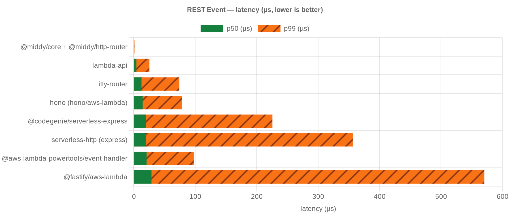
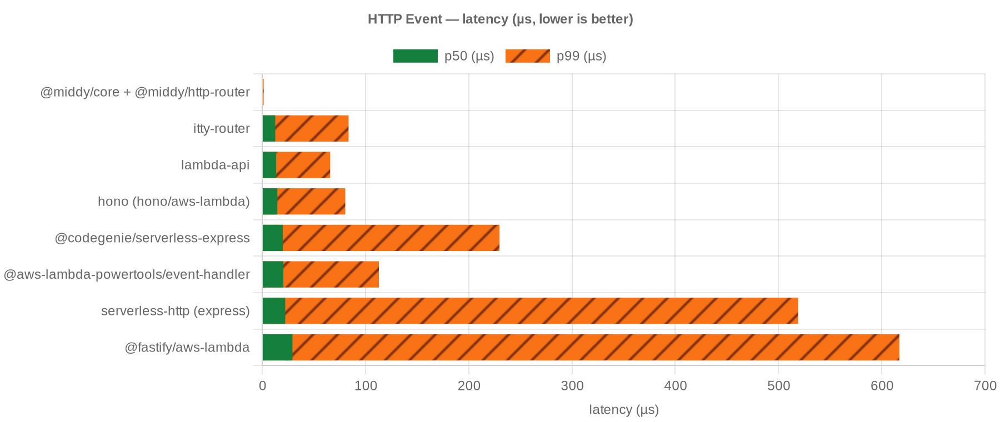
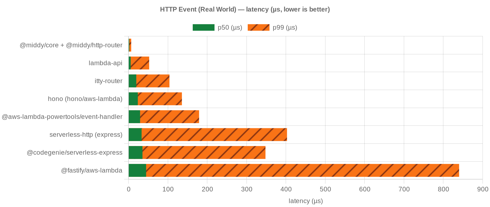
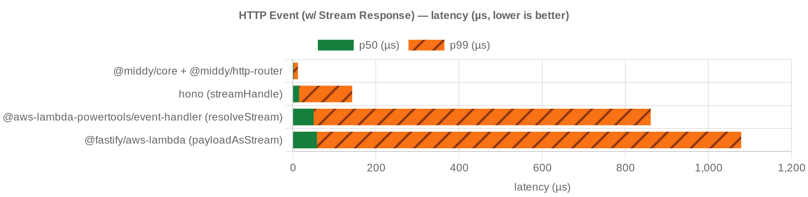
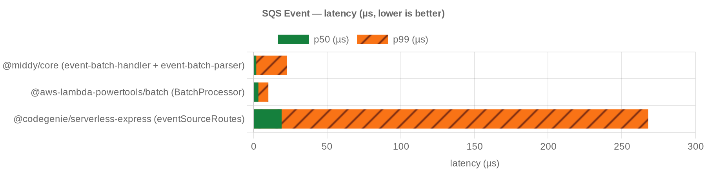

# aws-lambda-framework-benchmark

tinybench benchmark comparing AWS Lambda wrappers across REST, HTTP, HTTP (real world), HTTP streaming, SQS, and SNS events. Each candidate runs in its own isolated process — and, for the Lambda tiers, its own memory-capped container — so one wrapper gets the full memory allotment, mirroring a real Lambda. Lower p50/p99 is better; `OOM` means the wrapper exceeded that memory tier.

Numbers below are from [`results/lambda-512MB/`](results/lambda-512MB/) (Lambda 512 MB / 1 core). Other tiers:

- [Lambda 128 MB](results/lambda-128MB/README.md)
- [Lambda 256 MB](results/lambda-256MB/README.md)
- [Lambda 512 MB](results/lambda-512MB/README.md) — canonical
- [Lambda 1024 MB](results/lambda-1024MB/README.md)
- [local Node](results/local/README.md)

```sh
npm install
npm run bench                 # all scenarios, local Node
npm run bench:http            # single scenario, local Node
npm run bench:docker          # all scenarios across Lambda memory tiers
```

## REST Event



<!-- bench:rest -->

| candidate | p50 ns | p99 ns | ops/sec |
| --- | --- | --- | --- |
| @middy/core + @middy/http-router | 583 | 1208 | 1,748,663 |
| lambda-api | 4334 | 25514 | 222,629 |
| itty-router | 12667 | 74317 | 75,129 |
| hono (hono/aws-lambda) | 14541 | 78201 | 65,076 |
| @codegenie/serverless-express | 19833 | 225708 | 46,587 |
| serverless-http (express) | 19833 | 356463 | 47,007 |
| @aws-lambda-powertools/event-handler | 20958 | 97739 | 44,975 |
| @fastify/aws-lambda | 28875 | 570660 | 33,481 |

<!-- bench:rest -->

## HTTP Event



<!-- bench:http -->

| candidate | p50 ns | p99 ns | ops/sec |
| --- | --- | --- | --- |
| @middy/core + @middy/http-router | 625 | 1416 | 1,588,693 |
| itty-router | 12625 | 83625 | 75,192 |
| lambda-api | 13542 | 65819 | 71,605 |
| hono (hono/aws-lambda) | 14666 | 80439 | 65,015 |
| @codegenie/serverless-express | 19917 | 229784 | 46,928 |
| @aws-lambda-powertools/event-handler | 20500 | 113004 | 45,694 |
| serverless-http (express) | 22292 | 518980 | 42,514 |
| @fastify/aws-lambda | 29270 | 617069 | 32,955 |

<!-- bench:http -->

## HTTP Event (Real World)



<!-- bench:http-real-world -->

| candidate | p50 ns | p99 ns | ops/sec |
| --- | --- | --- | --- |
| @middy/core + @middy/http-router | 2042 | 6916 | 473,652 |
| lambda-api | 5583 | 52541 | 173,877 |
| itty-router | 19792 | 104079 | 47,356 |
| hono (hono/aws-lambda) | 23709 | 135737 | 38,865 |
| @aws-lambda-powertools/event-handler | 29458 | 179367 | 31,895 |
| serverless-http (express) | 33333 | 402835 | 29,431 |
| @codegenie/serverless-express | 35542 | 348109 | 27,904 |
| @fastify/aws-lambda | 44792 | 840148 | 20,070 |

<!-- bench:http-real-world -->

## HTTP Event (w/ Stream Response)



<!-- bench:http-stream -->

| candidate | p50 ns | p99 ns | ops/sec |
| --- | --- | --- | --- |
| @middy/core + @middy/http-router | 2417 | 12693 | 395,842 |
| hono (streamHandle) | 15375 | 143163 | 59,931 |
| @aws-lambda-powertools/event-handler (resolveStream) | 50541 | 861633 | 18,517 |
| @fastify/aws-lambda (payloadAsStream) | 58416 | 1079197 | 15,575 |

<!-- bench:http-stream -->

## SQS Event



<!-- bench:sqs -->

| candidate | p50 ns | p99 ns | ops/sec |
| --- | --- | --- | --- |
| @middy/core (event-batch-handler + event-batch-parser) | 1958 | 22709 | 495,729 |
| @aws-lambda-powertools/batch (BatchProcessor) | 3417 | 10167 | 284,782 |
| @codegenie/serverless-express (eventSourceRoutes) | 19166 | 268008 | 48,861 |

<!-- bench:sqs -->

## SNS Event


<!-- bench:sns -->

| candidate | p50 ns | p99 ns | ops/sec |
| --- | --- | --- | --- |
| @middy/core | 500 | 1250 | 2,038,497 |
| @codegenie/serverless-express (eventSourceRoutes) | 18417 | 254004 | 51,463 |

<!-- bench:sns -->

## Sources

<!-- sources -->

- [`@aws-lambda-powertools/event-handler`](https://www.npmjs.com/package/@aws-lambda-powertools/event-handler)
- [`@codegenie/serverless-express`](https://www.npmjs.com/package/@codegenie/serverless-express)
- [`@fastify/aws-lambda`](https://www.npmjs.com/package/@fastify/aws-lambda)
- [`@middy/core`](https://www.npmjs.com/package/@middy/core)
- [`hono/aws-lambda`](https://www.npmjs.com/package/hono)
- [`itty-router`](https://www.npmjs.com/package/itty-router)
- [`lambda-api`](https://www.npmjs.com/package/lambda-api)
- [`serverless-h3`](https://www.npmjs.com/package/serverless-h3)
- [`serverless-http`](https://www.npmjs.com/package/serverless-http)

<!-- sources -->
