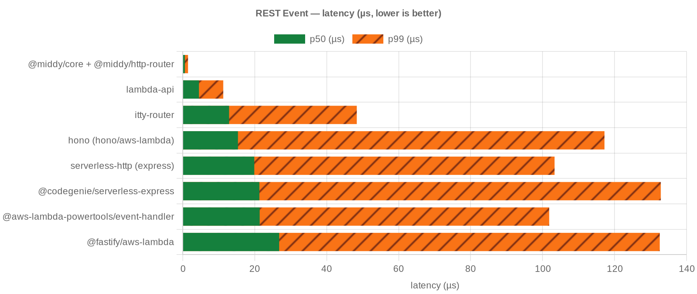
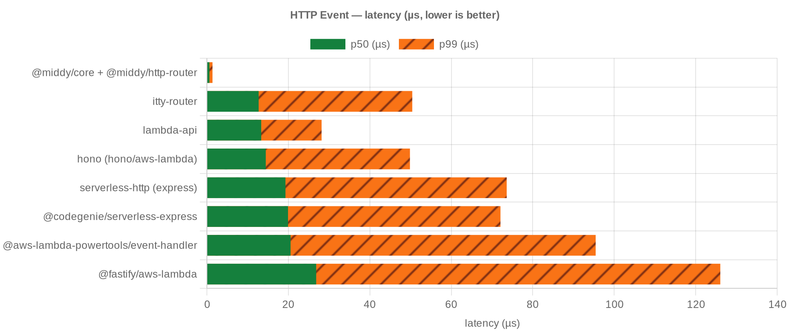
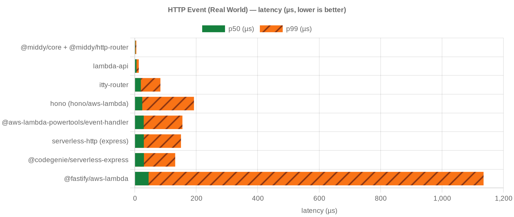
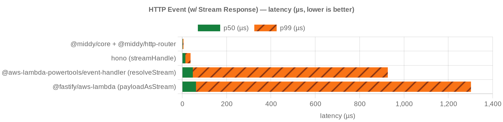
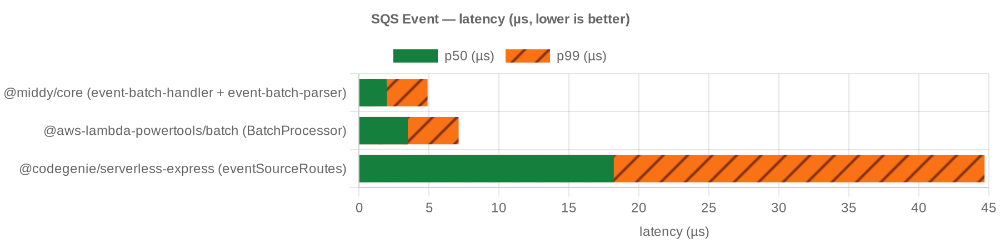
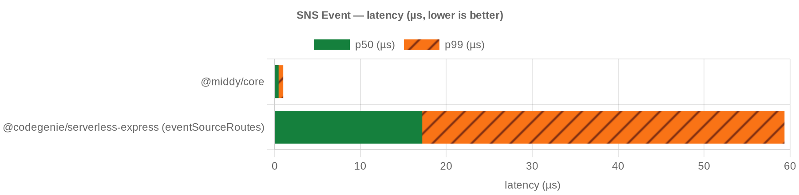

# Benchmark results — Lambda 1024 MB / 1 core

In-process tinybench. Lower p50/p99 is better.

## REST Event

<!-- bench:rest -->

| candidate | p50 ns | p99 ns | ops/sec |
| --- | --- | --- | --- |
| @middy/core + @middy/http-router | 583 | 1458 | 1,687,985 |
| lambda-api | 4500 | 11250 | 217,262 |
| itty-router | 12875 | 48360 | 75,015 |
| hono (hono/aws-lambda) | 15333 | 117193 | 61,990 |
| serverless-http (express) | 19875 | 103323 | 47,295 |
| @codegenie/serverless-express | 21292 | 132845 | 44,013 |
| @aws-lambda-powertools/event-handler | 21375 | 101830 | 44,567 |
| @fastify/aws-lambda | 26791 | 132555 | 37,204 |

<!-- bench:rest -->

## HTTP Event

<!-- bench:http -->

| candidate | p50 ns | p99 ns | ops/sec |
| --- | --- | --- | --- |
| @middy/core + @middy/http-router | 625 | 1375 | 1,601,096 |
| itty-router | 12708 | 50418 | 75,487 |
| lambda-api | 13333 | 28158 | 73,209 |
| hono (hono/aws-lambda) | 14459 | 49849 | 66,237 |
| serverless-http (express) | 19292 | 73601 | 48,360 |
| @codegenie/serverless-express | 19917 | 72071 | 47,391 |
| @aws-lambda-powertools/event-handler | 20542 | 95443 | 46,574 |
| @fastify/aws-lambda | 26833 | 126042 | 36,449 |

<!-- bench:http -->

## HTTP Event (Real World)

<!-- bench:http-real-world -->

| candidate | p50 ns | p99 ns | ops/sec |
| --- | --- | --- | --- |
| @middy/core + @middy/http-router | 2042 | 5000 | 475,917 |
| lambda-api | 5625 | 12990 | 174,268 |
| itty-router | 19708 | 83425 | 48,022 |
| hono (hono/aws-lambda) | 24334 | 192648 | 38,452 |
| @aws-lambda-powertools/event-handler | 29167 | 155083 | 32,995 |
| serverless-http (express) | 29458 | 150378 | 31,742 |
| @codegenie/serverless-express | 29833 | 131550 | 31,910 |
| @fastify/aws-lambda | 45042 | 1135334 | 20,963 |

<!-- bench:http-real-world -->

## HTTP Event (w/ Stream Response)

<!-- bench:http-stream -->

| candidate | p50 ns | p99 ns | ops/sec |
| --- | --- | --- | --- |
| @middy/core + @middy/http-router | 2500 | 5791 | 390,310 |
| hono (streamHandle) | 14417 | 37678 | 65,621 |
| @aws-lambda-powertools/event-handler (resolveStream) | 47958 | 927119 | 19,945 |
| @fastify/aws-lambda (payloadAsStream) | 62292 | 1302210 | 14,912 |

<!-- bench:http-stream -->

## SQS Event

<!-- bench:sqs -->

| candidate | p50 ns | p99 ns | ops/sec |
| --- | --- | --- | --- |
| @middy/core (event-batch-handler + event-batch-parser) | 2000 | 4906 | 490,829 |
| @aws-lambda-powertools/batch (BatchProcessor) | 3500 | 7125 | 282,942 |
| @codegenie/serverless-express (eventSourceRoutes) | 18208 | 44691 | 52,682 |

<!-- bench:sqs -->

## SNS Event

<!-- bench:sns -->

| candidate | p50 ns | p99 ns | ops/sec |
| --- | --- | --- | --- |
| @middy/core | 500 | 1041 | 2,038,413 |
| @codegenie/serverless-express (eventSourceRoutes) | 17209 | 59347 | 54,861 |

<!-- bench:sns -->
