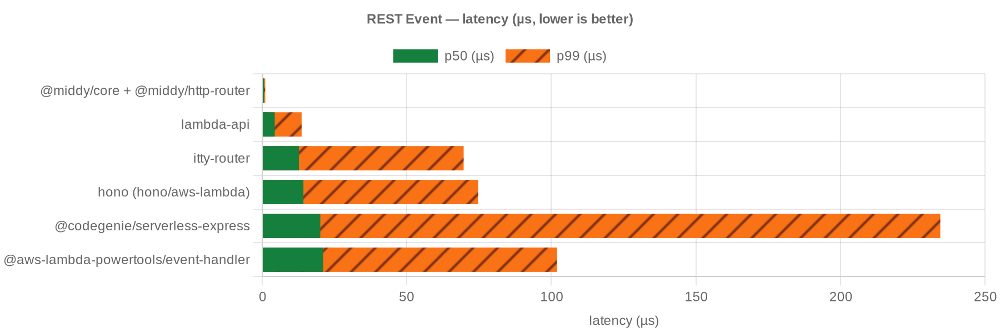
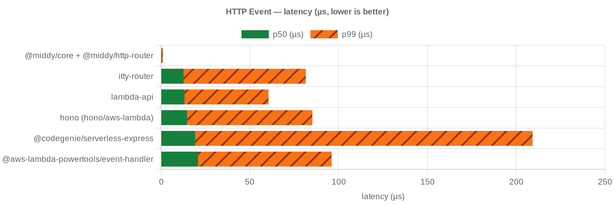
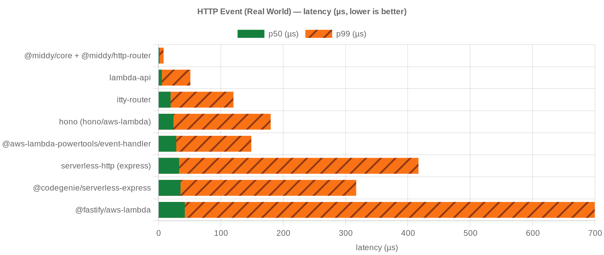
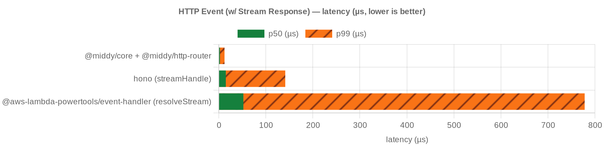
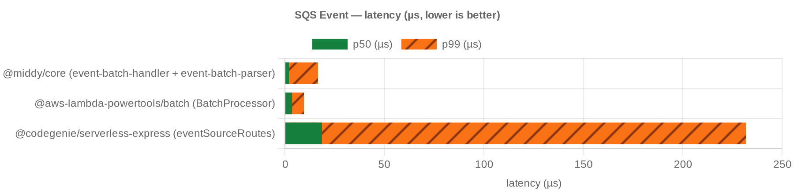
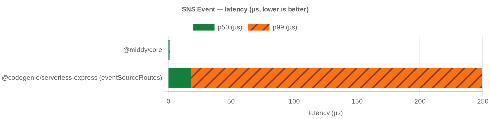

# Benchmark results — Lambda 128 MB / 1 core

In-process tinybench. Lower p50/p99 is better.

## REST Event

<!-- bench:rest -->

| candidate | p50 ns | p99 ns | ops/sec | error |
| --- | --- | --- | --- | --- |
| @middy/core + @middy/http-router | 583 | 1041 | 1,748,578 |  |
| lambda-api | 4333 | 13625 | 225,273 |  |
| itty-router | 12708 | 69667 | 75,826 |  |
| hono (hono/aws-lambda) | 14250 | 74695 | 66,829 |  |
| @codegenie/serverless-express | 20084 | 234539 | 46,054 |  |
| @aws-lambda-powertools/event-handler | 21084 | 101995 | 44,706 |  |
| @fastify/aws-lambda |  |  |  | OOM |
| serverless-http (express) |  |  |  | OOM |

<!-- bench:rest -->

## HTTP Event

<!-- bench:http -->

| candidate | p50 ns | p99 ns | ops/sec | error |
| --- | --- | --- | --- | --- |
| @middy/core + @middy/http-router | 625 | 1042 | 1,614,070 |  |
| itty-router | 12708 | 81551 | 74,996 |  |
| lambda-api | 13208 | 60557 | 74,129 |  |
| hono (hono/aws-lambda) | 14667 | 85272 | 64,477 |  |
| @codegenie/serverless-express | 19250 | 209302 | 48,444 |  |
| @aws-lambda-powertools/event-handler | 20875 | 96076 | 45,587 |  |
| @fastify/aws-lambda |  |  |  | OOM |
| serverless-http (express) |  |  |  | OOM |

<!-- bench:http -->

## HTTP Event (Real World)

<!-- bench:http-real-world -->

| candidate | p50 ns | p99 ns | ops/sec |
| --- | --- | --- | --- |
| @middy/core + @middy/http-router | 2000 | 8292 | 485,291 |
| lambda-api | 5541 | 51250 | 174,461 |
| itty-router | 19583 | 120349 | 47,581 |
| hono (hono/aws-lambda) | 24208 | 180073 | 38,645 |
| @aws-lambda-powertools/event-handler | 28625 | 149023 | 33,037 |
| serverless-http (express) | 33250 | 417044 | 29,462 |
| @codegenie/serverless-express | 35541 | 317181 | 27,832 |
| @fastify/aws-lambda | 42333 | 699700 | 21,886 |

<!-- bench:http-real-world -->

## HTTP Event (w/ Stream Response)

<!-- bench:http-stream -->

| candidate | p50 ns | p99 ns | ops/sec | error |
| --- | --- | --- | --- | --- |
| @middy/core + @middy/http-router | 2500 | 12209 | 387,919 |  |
| hono (streamHandle) | 14958 | 141389 | 61,445 |  |
| @aws-lambda-powertools/event-handler (resolveStream) | 52292 | 778161 | 18,025 |  |
| @fastify/aws-lambda (payloadAsStream) |  |  |  | OOM |

<!-- bench:http-stream -->

## SQS Event

<!-- bench:sqs -->

| candidate | p50 ns | p99 ns | ops/sec |
| --- | --- | --- | --- |
| @middy/core (event-batch-handler + event-batch-parser) | 2000 | 16625 | 485,421 |
| @aws-lambda-powertools/batch (BatchProcessor) | 3583 | 9542 | 274,269 |
| @codegenie/serverless-express (eventSourceRoutes) | 18625 | 231850 | 50,534 |

<!-- bench:sqs -->

## SNS Event

<!-- bench:sns -->

| candidate | p50 ns | p99 ns | ops/sec |
| --- | --- | --- | --- |
| @middy/core | 500 | 1167 | 2,014,546 |
| @codegenie/serverless-express (eventSourceRoutes) | 18208 | 249631 | 51,053 |

<!-- bench:sns -->
