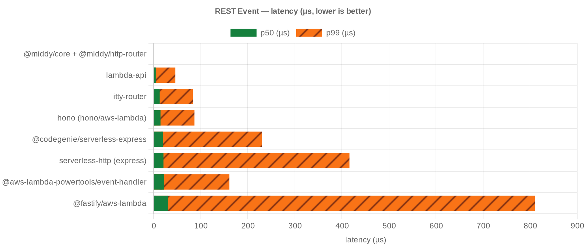
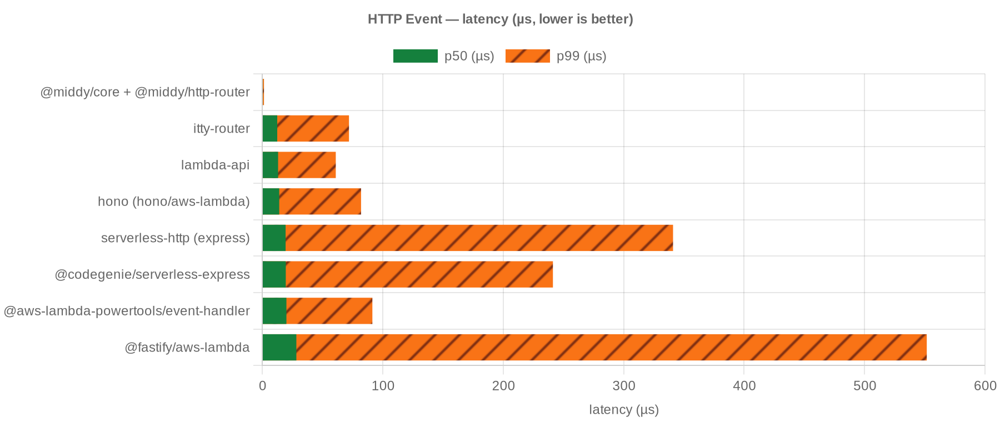
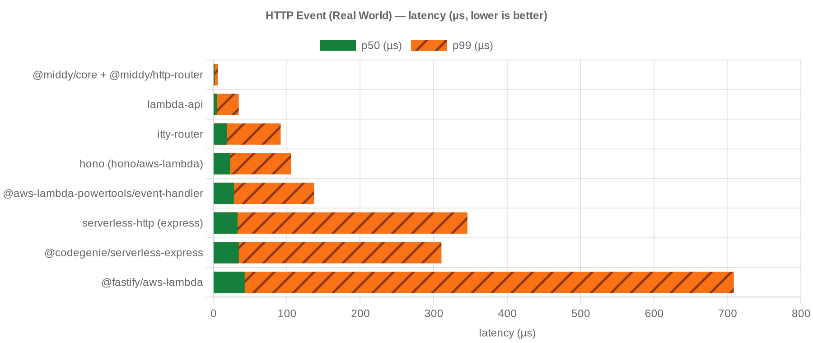
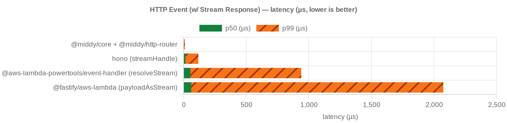
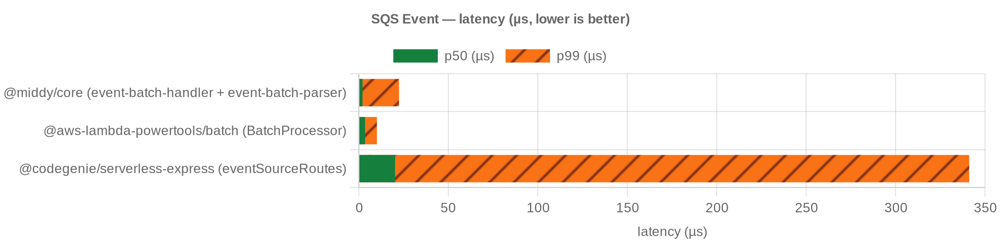
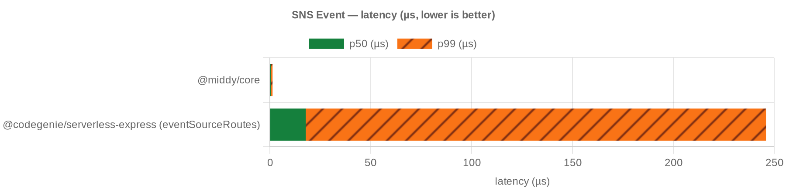

# Benchmark results — Lambda 256 MB / 1 core

In-process tinybench. Lower p50/p99 is better.

## REST Event

<!-- bench:rest -->

| candidate | p50 ns | p99 ns | ops/sec |
| --- | --- | --- | --- |
| @middy/core + @middy/http-router | 542 | 1250 | 1,795,604 |
| lambda-api | 4500 | 45939 | 215,705 |
| itty-router | 12833 | 83247 | 74,095 |
| hono (hono/aws-lambda) | 14625 | 86709 | 64,462 |
| @codegenie/serverless-express | 19792 | 229625 | 46,644 |
| serverless-http (express) | 20917 | 416087 | 44,773 |
| @aws-lambda-powertools/event-handler | 22000 | 160786 | 42,903 |
| @fastify/aws-lambda | 30542 | 810084 | 31,141 |

<!-- bench:rest -->

## HTTP Event

<!-- bench:http -->

| candidate | p50 ns | p99 ns | ops/sec |
| --- | --- | --- | --- |
| @middy/core + @middy/http-router | 583 | 1459 | 1,683,442 |
| itty-router | 12459 | 72023 | 76,272 |
| lambda-api | 13167 | 61062 | 73,696 |
| hono (hono/aws-lambda) | 14125 | 82041 | 66,564 |
| serverless-http (express) | 19417 | 341038 | 47,681 |
| @codegenie/serverless-express | 19562 | 241321 | 47,007 |
| @aws-lambda-powertools/event-handler | 20084 | 91444 | 46,532 |
| @fastify/aws-lambda | 28333 | 551658 | 34,513 |

<!-- bench:http -->

## HTTP Event (Real World)

<!-- bench:http-real-world -->

| candidate | p50 ns | p99 ns | ops/sec |
| --- | --- | --- | --- |
| @middy/core + @middy/http-router | 1959 | 6292 | 494,991 |
| lambda-api | 5292 | 34806 | 182,627 |
| itty-router | 19083 | 91871 | 49,152 |
| hono (hono/aws-lambda) | 23125 | 105852 | 40,115 |
| @aws-lambda-powertools/event-handler | 28208 | 137369 | 33,258 |
| serverless-http (express) | 33208 | 346161 | 29,290 |
| @codegenie/serverless-express | 34917 | 310775 | 28,227 |
| @fastify/aws-lambda | 42875 | 708835 | 21,890 |

<!-- bench:http-real-world -->

## HTTP Event (w/ Stream Response)

<!-- bench:http-stream -->

| candidate | p50 ns | p99 ns | ops/sec |
| --- | --- | --- | --- |
| @middy/core + @middy/http-router | 2458 | 9667 | 396,500 |
| hono (streamHandle) | 14500 | 117325 | 63,480 |
| @aws-lambda-powertools/event-handler (resolveStream) | 53833 | 939698 | 16,848 |
| @fastify/aws-lambda (payloadAsStream) | 60563 | 2074636 | 14,728 |

<!-- bench:http-stream -->

## SQS Event

<!-- bench:sqs -->

| candidate | p50 ns | p99 ns | ops/sec |
| --- | --- | --- | --- |
| @middy/core (event-batch-handler + event-batch-parser) | 2041 | 22454 | 477,702 |
| @aws-lambda-powertools/batch (BatchProcessor) | 3458 | 10087 | 284,087 |
| @codegenie/serverless-express (eventSourceRoutes) | 20208 | 341176 | 46,374 |

<!-- bench:sqs -->

## SNS Event

<!-- bench:sns -->

| candidate | p50 ns | p99 ns | ops/sec |
| --- | --- | --- | --- |
| @middy/core | 500 | 1334 | 1,924,859 |
| @codegenie/serverless-express (eventSourceRoutes) | 17792 | 245903 | 51,954 |

<!-- bench:sns -->
