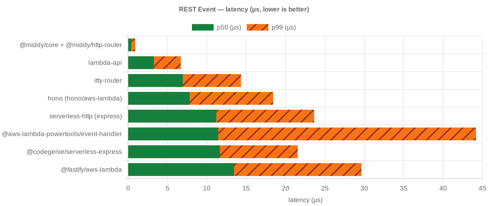
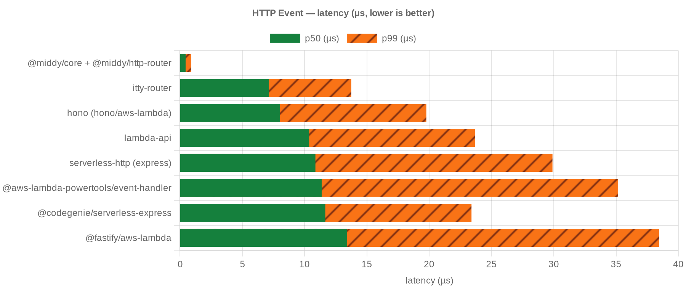
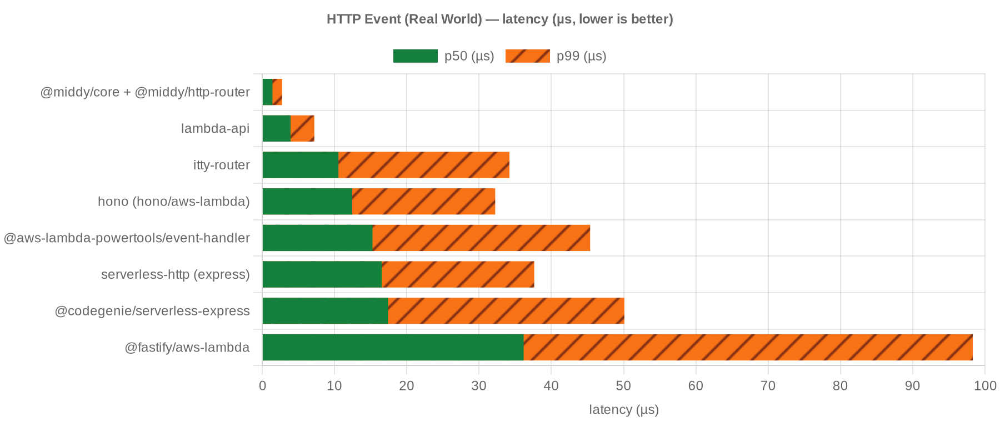
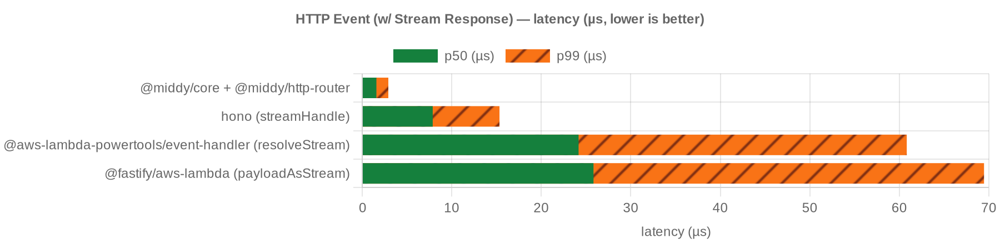
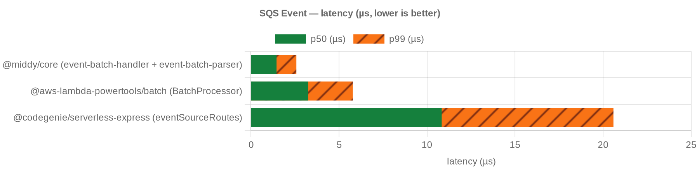
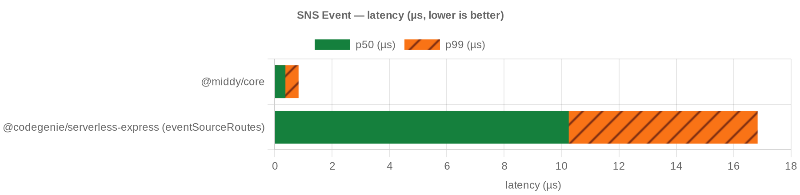

# Benchmark results — local Node

In-process tinybench. Lower p50/p99 is better.

## REST Event

<!-- bench:rest -->

| candidate | p50 ns | p99 ns | ops/sec |
| --- | --- | --- | --- |
| @middy/core + @middy/http-router | 417 | 917 | 2,209,523 |
| lambda-api | 3291 | 6708 | 299,849 |
| itty-router | 6958 | 14334 | 140,410 |
| hono (hono/aws-lambda) | 7834 | 18417 | 124,142 |
| serverless-http (express) | 11208 | 23625 | 86,524 |
| @aws-lambda-powertools/event-handler | 11458 | 44167 | 84,963 |
| @codegenie/serverless-express | 11667 | 21541 | 83,136 |
| @fastify/aws-lambda | 13458 | 29625 | 71,183 |

<!-- bench:rest -->

## HTTP Event

<!-- bench:http -->

| candidate | p50 ns | p99 ns | ops/sec |
| --- | --- | --- | --- |
| @middy/core + @middy/http-router | 458 | 917 | 2,103,747 |
| itty-router | 7125 | 13750 | 137,516 |
| hono (hono/aws-lambda) | 8041 | 19775 | 123,410 |
| lambda-api | 10375 | 23685 | 95,590 |
| serverless-http (express) | 10875 | 29898 | 88,419 |
| @aws-lambda-powertools/event-handler | 11375 | 35167 | 86,032 |
| @codegenie/serverless-express | 11667 | 23399 | 83,643 |
| @fastify/aws-lambda | 13417 | 38451 | 71,559 |

<!-- bench:http -->

## HTTP Event (Real World)

<!-- bench:http-real-world -->

| candidate | p50 ns | p99 ns | ops/sec |
| --- | --- | --- | --- |
| @middy/core + @middy/http-router | 1416 | 2750 | 699,344 |
| lambda-api | 3917 | 7208 | 251,859 |
| itty-router | 10542 | 34208 | 92,120 |
| hono (hono/aws-lambda) | 12458 | 32235 | 78,386 |
| @aws-lambda-powertools/event-handler | 15250 | 45369 | 64,016 |
| serverless-http (express) | 16542 | 37636 | 59,245 |
| @codegenie/serverless-express | 17417 | 50104 | 55,037 |
| @fastify/aws-lambda | 36166 | 98316 | 26,357 |

<!-- bench:http-real-world -->

## HTTP Event (w/ Stream Response)

<!-- bench:http-stream -->

| candidate | p50 ns | p99 ns | ops/sec |
| --- | --- | --- | --- |
| @middy/core + @middy/http-router | 1583 | 2917 | 621,313 |
| hono (streamHandle) | 7875 | 15333 | 122,485 |
| @aws-lambda-powertools/event-handler (resolveStream) | 24167 | 60826 | 39,547 |
| @fastify/aws-lambda (payloadAsStream) | 25833 | 69457 | 36,377 |

<!-- bench:http-stream -->

## SQS Event

<!-- bench:sqs -->

| candidate | p50 ns | p99 ns | ops/sec |
| --- | --- | --- | --- |
| @middy/core (event-batch-handler + event-batch-parser) | 1458 | 2584 | 679,788 |
| @aws-lambda-powertools/batch (BatchProcessor) | 3250 | 5791 | 304,637 |
| @codegenie/serverless-express (eventSourceRoutes) | 10834 | 20583 | 89,713 |

<!-- bench:sqs -->

## SNS Event

<!-- bench:sns -->

| candidate | p50 ns | p99 ns | ops/sec |
| --- | --- | --- | --- |
| @middy/core | 375 | 833 | 2,503,562 |
| @codegenie/serverless-express (eventSourceRoutes) | 10250 | 16833 | 95,631 |

<!-- bench:sns -->
